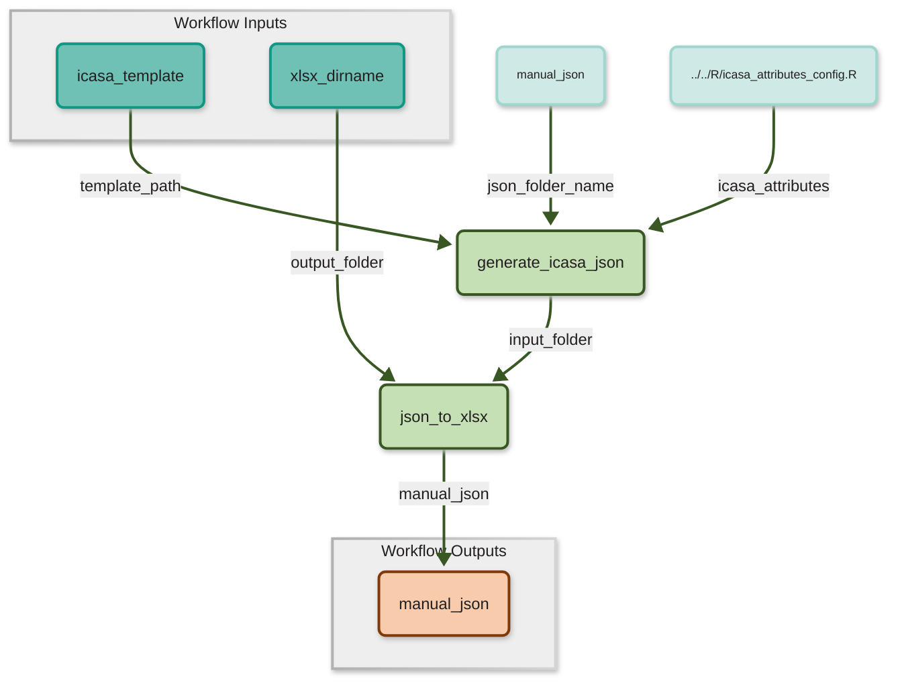
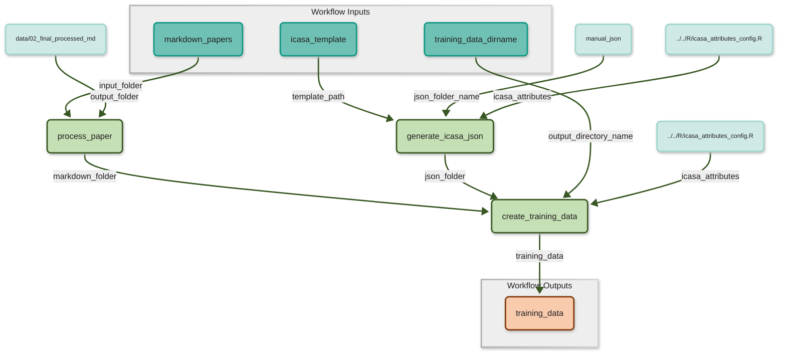
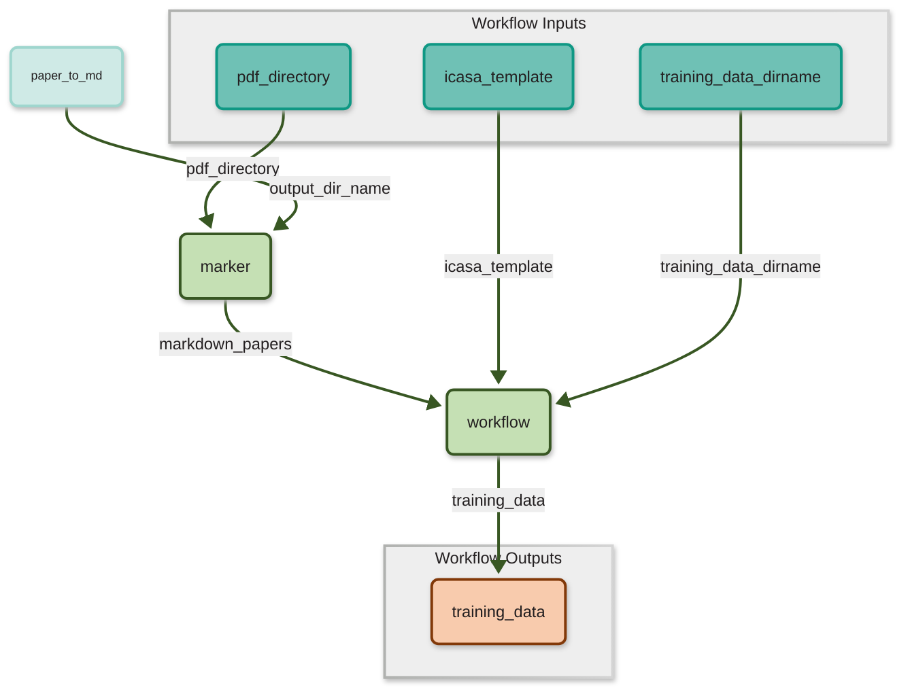

# Workflows
This folder contains multiple CWL (Common Workflow Language) Descriptions of the given R- and Python-Scripts. CWL is used to wrap Steps into `CommandLineTool`s which are combined to multiple Workflows. However one step `fine_tune_model` requires manual work. This is representated by an abstract description of type `Operation` making all workflows that contain this step non-executable.

Some of the Workflows contained herein and described herafter are for the validation of data to circumvent the problem of the manual `fine_tune_model` step and also the `llm_extract_icasa` step which needs an API key to use the fine-tuned models on OpenAI Platform. The Results of the combination of those steps in `tune_and_use_llm_model` are stored in this repository at `/data/07_llm_output_json`.
The `marker` step which converts PDFs to markdown is also not used in most of the executable steps as the PDFs are not part of this repository due to copyright limitations. Its output is located at `data/01_paper_to_md`.

## Generate Manual Tabular Data
`generate_manual_data` contains a workflow which extracts the manual data from the ICASA Template into JSON which is than converted into a tabular format, more specifically XLSX. Its purpose is to generate the manual ground truth data which later is compared to the LLM generated data.

### Usage:
```
cwltool workflows/generate_manual_data/workflow.cwl inputs_generate_manual_data.yaml
```



## Generate Training Data
`generate_training_data` contains a workflow which processes the extracted markdownfiles and generates training data in JSONL format by also using data from the ICASA template. This JSONL files need to be manually uploaded to OpenAIs Platform. That's why this workflow contains all needed steps up to this point and exits here. 
The `marker` step is left out on purpose on this workflow due to copyright limitations.

### Usage:
```
cwltool workflows/generate_training_data/workflow.cwl inputs_generate_training_data.yaml
```



The `marker` step can be used together with `generate_training_data` as subworkflow by using `workflows/generate_training_data_using_marker/workflow.cwl` which gives the opportunity to use this pipeline with different PDF files.
