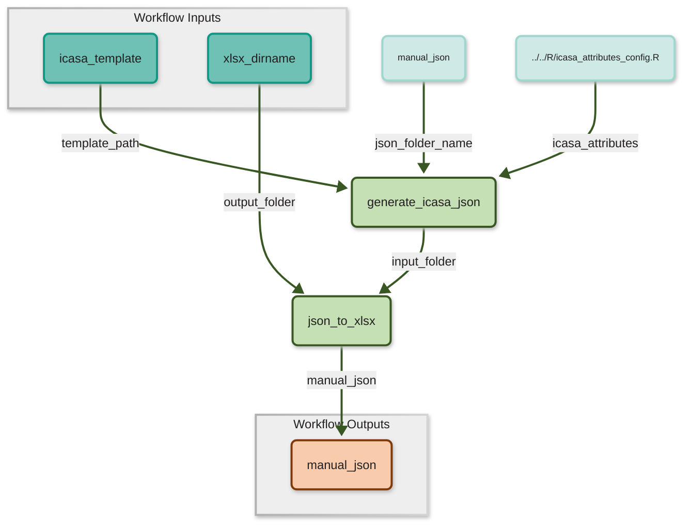
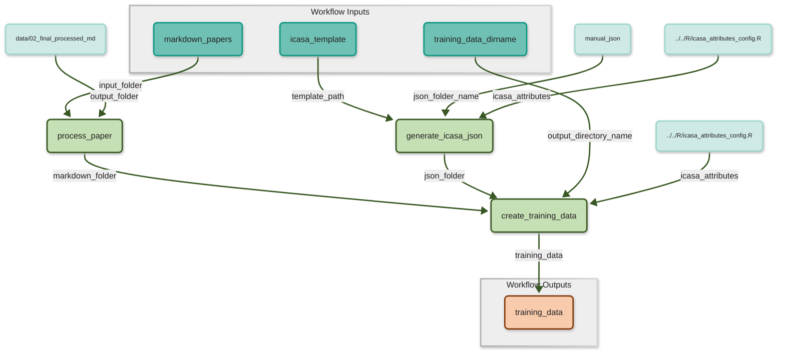

# Workflows
This folder contains multiple CWL (Common Workflow Language) Descriptions of the given R- and Python-Scripts. CWL is used to wrap Steps into `CommandLineTool`s which are combined to multiple Workflows. However one step `fine_tune_model` requires manual work. This is representated by an abstract description of type `Operation` making all workflows that contain this step non-executable.

## Generate Manual Tabular Data
`generate_manual_data` contains a workflow which extracts the manual data from the ICASA Template into JSON which is than converted into a tabular format, more specifically XLSX.

## Generate Training Data
`generate_training_data` contains a workflow which processes the extracted markdownfiles and generates training data in JSONL format by also using data from the ICASA template.

